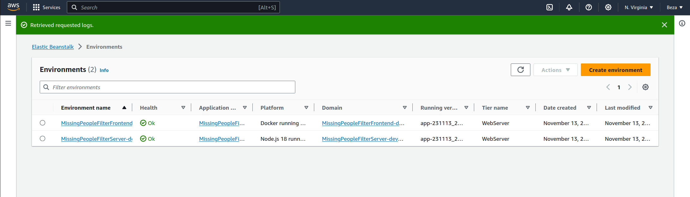
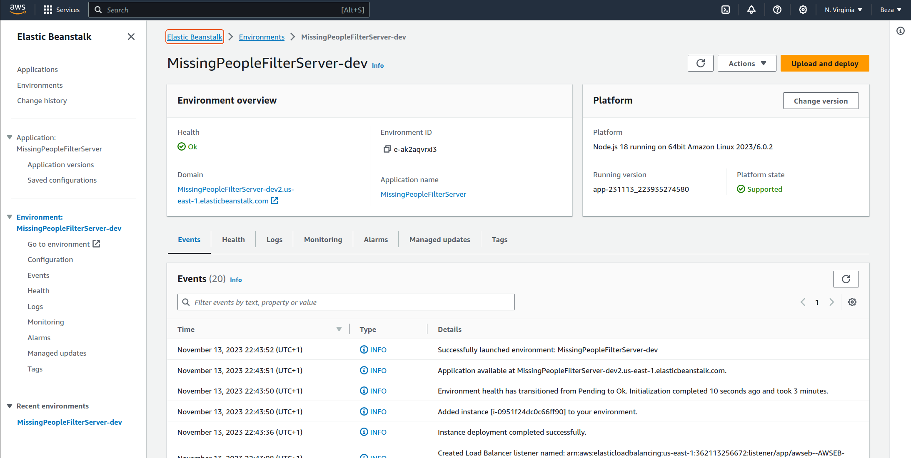
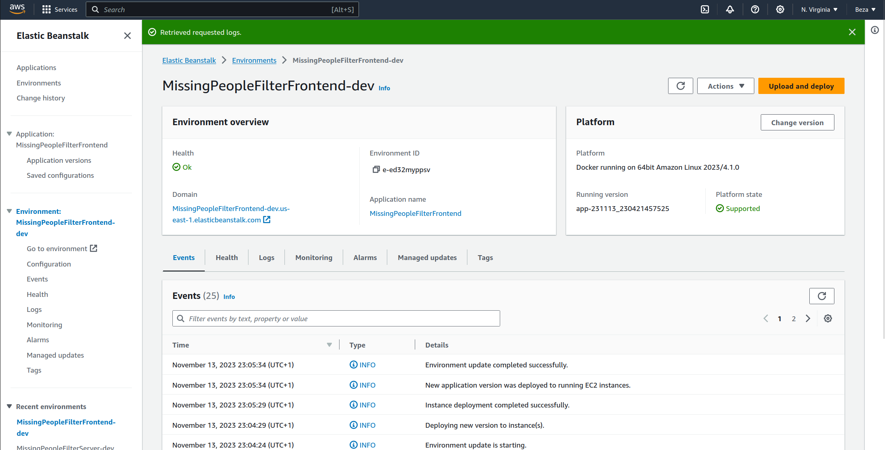
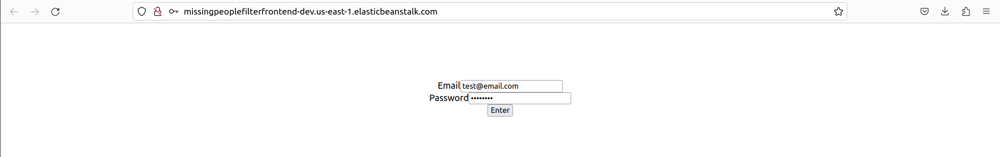
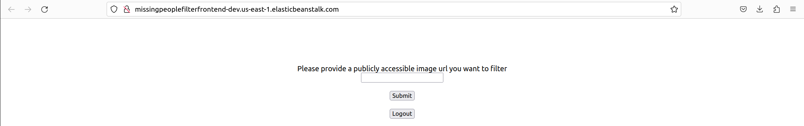
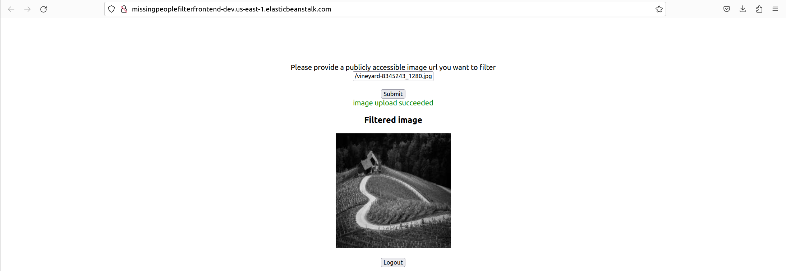

## Udacity Fullstack App AWS - Project 2
### Image Filter App
Project Description:

You have been hired as a software engineer to develop an application that will help the FBI find missing people. The application will upload images to the FBI cloud database hosted in AWS. This will allow the FBI to run facial recognition software on the images to detect a match. You will be developing a NodeJS server and deploying it on AWS Elastic Beanstalk.

The app consists of:
- An expressJs backend server running on nodejs
- A react frontend service running on nodejs

To Run the applications locally
- Go to the directory MissingPeopleFilterServer and `run npm run dev`
- you can test the service by 
- to authenticate, run in your terminal

```
curl --location 'localhost:8082/auth/token' \
--header 'Content-Type: application/json' \
--data-raw '{
   "email":"test@email.com", 
   "password":"password"
}' 
```
- to run the image filter service as an authenticated user, copy the access token from the reponse above.
```
curl --location 'localhost:8082/filteredImages?image_url=https%3A%2F%2Fcdn.pixabay.com%2Fphoto%2F2023%2F10%2F27%2F12%2F13%2Fvineyard-8345243_1280.jpg' \
--header 'Authorization: Bearer TOKEN_YOU_COPIED'
```

- to run this from the frontend, go to MissingPeopleFilterFrontend directory and run `npm start`
- it will open the login page in your browser (at localhost:3000)
- you can type in the username and password above into the input boxes.
- once logged in, it should redirect you to the image url upload page.
- insert a publicly accessible url (e.g https://upload.wikimedia.org/wikipedia/commons/b/bd/Golden_tabby_and_white_kitten_n01.jpg) into the input box and click `submit`
- your image should be processed and a filterd image loaded with a success message.

To access from AWS
- backend url http://missingpeoplefilterserver-dev2.us-east-1.elasticbeanstalk.com/
- frontend url http://missingpeoplefilterfrontend-dev.us-east-1.elasticbeanstalk.com/

deployment screen shots:

Environments List: 


Server Environment Details:


Frontend Environment Details:


Frontend: 

Login page

Upload Image URL page

Filtered Image result page



Note: 
- you might get a `401 unauthorised` error if you do the get request without providing authentication token 
- the user database implementation is not included in this demo to save resources 
